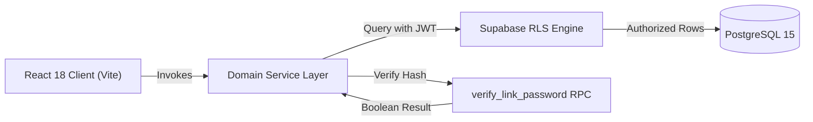

# AeroLink 🚀
### Modern URL Management, Link Security & Real-Time Telemetry Platform

[](https://reactjs.org/)
[](https://vitejs.dev/)
[](https://tailwindcss.com/)
[](https://supabase.com/)
[](https://vitest.dev/)
[](https://opensource.org/licenses/MIT)

AeroLink is a high-performance, production-grade URL management and analytics platform engineered with **React 18**, **Vite**, **Tailwind CSS**, and **Supabase (PostgreSQL + Row-Level Security)**. 

Originally inspired by the basic URL shortener tutorial by [RoadsideCoder](https://github.com/piyush-eon), AeroLink has been completely re-architected into an enterprise-ready SaaS application featuring cryptographically secure slug generation, server-side password-protected links, lifecycle expiration, click rate-limiting, privacy-preserving visitor telemetry, client-side multi-resolution QR generation, and full unit test coverage.

---

## 🌟 Tutorial vs. AeroLink Comparison Matrix

| Feature Dimension | Original Tutorial Project | AeroLink Platform |
| :--- | :--- | :--- |
| **Short-Code Generation** | `Math.random().toString(36).substring(2, 8)` (pseudo-random, predictable, high collision risk) | **Cryptographic Base62 `nanoid`** (`crypto.getRandomValues`, $3.5 \times 10^{12}$ combinations, collision retry loop) |
| **Link Controls** | Simple redirect only | **Granular Lifecycle Controls** (Active/Disabled toggle, Expiration timestamps, Click thresholds, Notes, Tags) |
| **Link Security** | None | **Zero-Knowledge Password Protection** verified server-side via PostgreSQL RPC (`verify_link_password`) |
| **QR Code Engine** | Canvas rendered, uploaded to Supabase Storage bucket (incurs storage cost & latency) | **High-Performance Client-Side QR Studio** (On-demand canvas, multi-resolution 150px/250px/400px PNG downloads, zero cloud storage costs) |
| **Analytics & Telemetry** | Basic total click counter & simple city list | **Deep Privacy-Preserving Suite** (Date range filtering [Today/7D/30D/All], unique visitor hashing, device/browser/OS breakdown, referrer analysis, live click stream, CSV export) |
| **Security Hardening** | Plain strings, `.env` tracked in git, unvalidated redirects | **Hardened** (Untracked `.env` + `.env.example`, open-redirect protection, XSS scheme filtering, RLS security policies) |
| **Testing & CI/CD** | 0 tests, prone to regression | **Automated Vitest Suite** (Unit tests covering crypto, validation logic, link lifecycle, and analytics aggregation) |
| **Architecture** | Direct ad-hoc database queries in view components | **Layered Architecture** (Clean separation of Views $\rightarrow$ Domain Services $\rightarrow$ API/DB Adapters $\rightarrow$ PostgreSQL) |
| **Offline Resilience** | App crashes without active Supabase credentials | **Seamless Demo Mode Fallback** (Local-storage mock client with full schema parity for evaluations and demos) |

---

## ⚡ Key Features & Engineering Highlights

### 1. Cryptographically Secure Collision-Resistant Slugs
- Generates 7-character Base62 slugs using standard Web Crypto API (`crypto.getRandomValues`).
- Employs an automated collision detection and retry strategy before failing gracefully.
- Comprehensive custom alias validation prevents routing collisions with platform endpoints (`/dashboard`, `/auth`, `/api`, etc.).

### 2. Comprehensive Link Lifecycle Management
- **Status Engine**: Computes real-time state (`Active`, `Expired`, `Limit Reached`, `Disabled`) based on user-defined constraints.
- **Expiration Controls**: Schedule automated link deactivation via ISO timestamps.
- **Click Thresholds**: Automatically disable links once a predetermined click quota is achieved.
- **In-Place Management**: Full CRUD capabilities including title/destination editing, tag categorization, notes, and one-click duplication.

### 3. Zero-Knowledge Password Protection via Database RPC
- Password-protected links prompt visitors with a security challenge before resolving the target.
- Password hashes are **never sent to the client browser**. The client computes `SHA256(password)` and verifies via the PostgreSQL function `verify_link_password(link_id, input_hash)`.
- Returns a boolean status without exposing cryptographic hashes over the wire.

### 4. Privacy-Preserving Analytics Suite
- **Unique Visitor Computation**: Uses salted one-way hashing (`SHA256(IP + UserAgent)`) without persisting raw IP addresses, complying with privacy standards (GDPR/ePrivacy).
- **Interactive Visualizations**: Click velocity AreaChart, Device category Donut chart, Operating System & Browser distributions, Top Referrers, and Country/City geographic breakdown.
- **Time Window Slicing**: Dynamic date filters (`Today`, `Last 7 Days`, `Last 30 Days`, `All Time`).
- **Telemetry Export**: Download full click telemetry datasets as structured CSV files.

### 5. Client-Side QR Studio
- Browser-native canvas rendering via `react-qrcode-logo` with instant visual preview.
- Eliminates cloud storage bucket dependencies, reducing cloud billable operations and network latency.
- Export options for high-resolution production assets in **150px**, **250px**, and **400px** PNG formats.

---

## 🏛️ System Architecture

Detailed architectural specifications, data flow diagrams, and RLS security matrices can be found in [`docs/ARCHITECTURE.md`](./docs/ARCHITECTURE.md).



---

## 🗄️ Database Schema & Migrations

AeroLink includes complete migration files and seed data in `supabase/`:

- **Migration**: [`supabase/migrations/20260921000000_aerolink_schema.sql`](./supabase/migrations/20260921000000_aerolink_schema.sql)
  - Creates `urls` and `clicks` tables with referential integrity.
  - Installs `verify_link_password` stored procedure.
  - Configures strict Row-Level Security policies.
- **Seed Data**: [`supabase/seed.sql`](./supabase/seed.sql)
  - Pre-populates realistic sample links, tags, notes, and click records.

---

## 🚀 Getting Started

### Prerequisites
- Node.js (v18 or higher recommended)
- npm or yarn

### 1. Clone & Install Dependencies
```bash
git clone https://github.com/your-username/aerolink.git
cd aerolink
npm install
```

### 2. Configure Environment Variables
Copy the example environment template:
```bash
cp .env.example .env
```

Fill in your Supabase project credentials in `.env`:
```env
VITE_SUPABASE_URL=https://your-project-id.supabase.co
VITE_SUPABASE_KEY=your-anon-public-key
```

> **Note:** If you do not configure a Supabase project, AeroLink automatically activates **Demo Mode**, allowing you to test the full interface, create links, generate QR codes, and view sample analytics using browser storage.

### 3. Run the Development Server
```bash
npm run dev
```
Navigate to `http://localhost:5173` in your browser.

---

## 🧪 Testing & Quality Assurance

AeroLink includes automated test suites powered by [Vitest](https://vitest.dev/):

```bash
# Run the complete test suite
npm test

# Run code linter
npm run lint

# Build optimized production bundle with manual vendor chunking
npm run build
```

---

## 🌐 Production Deployment

### Deploying to Vercel
1. Push your repository to GitHub.
2. Import the repository in [Vercel](https://vercel.com).
3. Set your environment variables (`VITE_SUPABASE_URL`, `VITE_SUPABASE_KEY`).
4. The included [`vercel.json`](./vercel.json) handles Single Page Application (SPA) URL rewrites automatically.

### Deploying to Netlify / Cloudflare Pages
- The included [`public/_redirects`](./public/_redirects) file configures SPA fallback rules (`/* /index.html 200`).

---

## 🔒 Security & Safe Computing
- **Open-Redirect Hardening**: All destination URLs are validated to adhere to `http:` or `https:` protocols, disallowing `javascript:`, `data:`, or file-based scheme exploits.
- **Open Source Credentials**: `.env` is omitted from version control via `.gitignore`. A sanitized template is provided in [`.env.example`](./.env.example).
- **Row-Level Security**: Unauthenticated users cannot read non-public columns or delete/mutate links owned by another user.

---

## 🤝 Attribution & Acknowledgements

AeroLink began as an exploration of the foundational URL shortener tutorial by [Piyush Agarwal (RoadsideCoder)](https://github.com/piyush-eon/url-shortener). 

While honoring that initial inspiration, the project was completely redesigned and re-engineered with modern SaaS enterprise standards:
- Base62 collision-resistant hashing algorithm.
- Multi-dimensional link lifecycle governance (expiration, quotas, active toggling).
- Server-side cryptographic password verification.
- Zero-cost client-side QR studio.
- Privacy-compliant telemetry engine with date filtering and CSV export.
- Clean component/service layered architecture and Vitest unit testing.

---

## 📄 License
This project is licensed under the [MIT License](./LICENSE).
