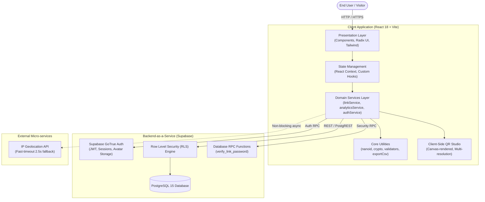
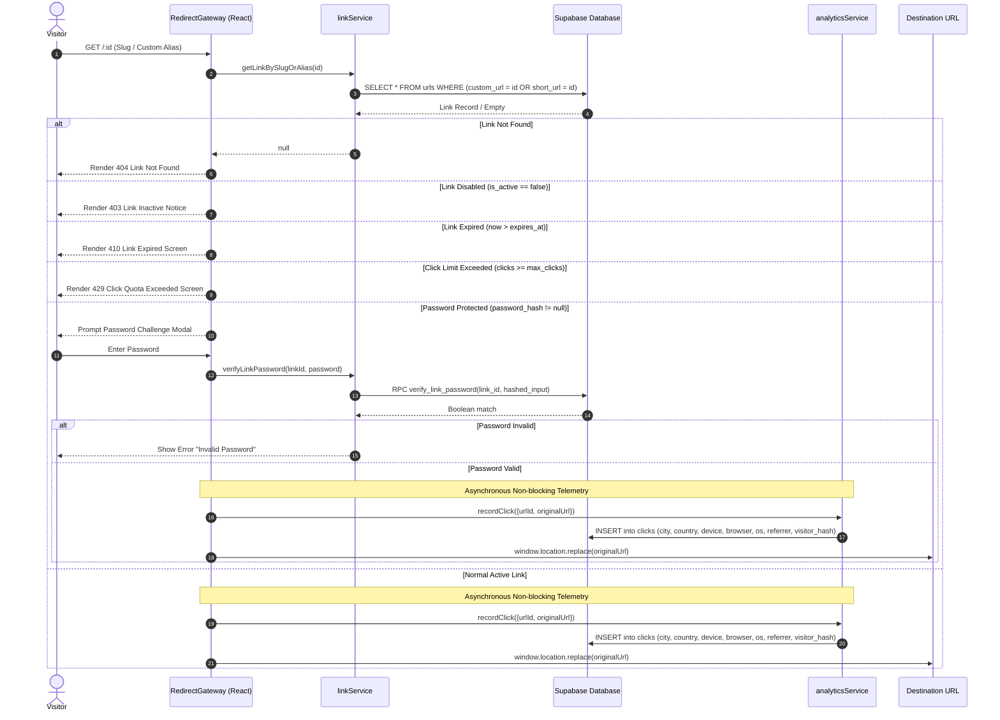
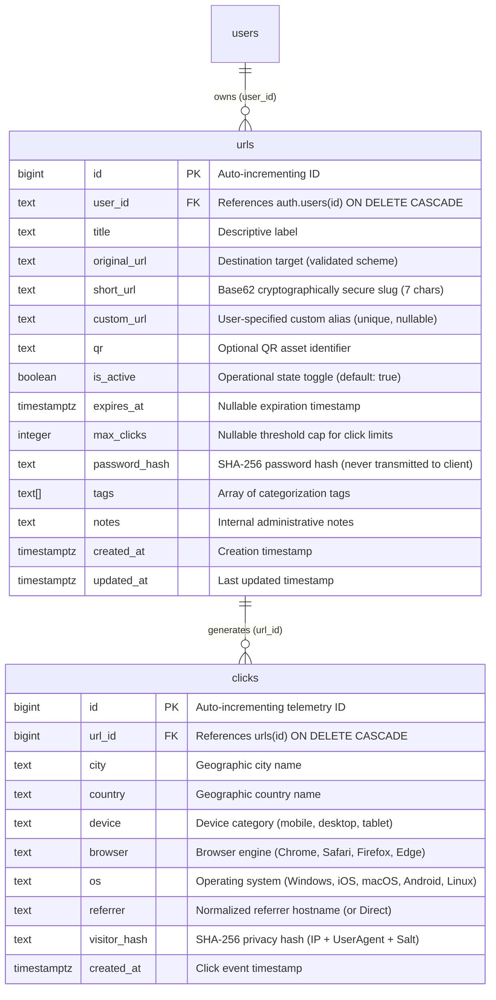

# AeroLink - System Architecture & Engineering Specifications

AeroLink is a high-performance, privacy-centric URL management, link security, and telemetry platform engineered with React 18, Vite, Tailwind CSS, and Supabase (PostgreSQL + Auth).

---

## 1. High-Level System Architecture

AeroLink is architected with a strict separation of concerns, decoupling UI presentation, business domain logic, and data storage access.

---

## 2. Gateway & Redirection Flow

When a user visits a shortened slug `/:id`, AeroLink executes a multi-step security validation pipeline prior to redirecting.

---

## 3. Database Schema & ERD

The database schema is structured for ACID compliance, referential integrity, and performant indexed lookups on slug queries.

### Key Database Indexes
- `urls(short_url)`: B-tree index for \(O(1)\) lookup on primary generated slugs.
- `urls(custom_url)`: Partial unique index for custom aliases.
- `urls(user_id)`: Index for fast retrieval of an authenticated user's portfolio.
- `clicks(url_id, created_at)`: Composite index for fast timeseries slicing and dashboard aggregations.

---

## 4. Row Level Security (RLS) Matrix

Supabase PostgreSQL enforces Row-Level Security directly at the database engine level. This guarantees that even if client-side code is tampered with, authorization cannot be bypassed.

| Table | Operation | Policy Name | Permitted Roles | Condition / Using Expression |
| :--- | :--- | :--- | :--- | :--- |
| `urls` | `SELECT` | `Public links viewable by all` | `anon`, `authenticated` | `true` (Enables redirect resolution) |
| `urls` | `INSERT` | `Authenticated users create links` | `authenticated` | `auth.uid()::text = user_id` |
| `urls` | `UPDATE` | `Owners can update own links` | `authenticated` | `auth.uid()::text = user_id` |
| `urls` | `DELETE` | `Owners can delete own links` | `authenticated` | `auth.uid()::text = user_id` |
| `clicks` | `INSERT` | `Public can insert clicks` | `anon`, `authenticated` | `true` (Telemetry logging) |
| `clicks` | `SELECT` | `Owners can view clicks` | `authenticated` | `EXISTS (SELECT 1 FROM urls WHERE urls.id = clicks.url_id AND urls.user_id = auth.uid()::text)` |

---

## 5. Security & Privacy Design Decisions

### 5.1 Zero-Knowledge Password Verification via RPC
In tutorial projects, password verification often queries the entire row (including the hash) down to the client, allowing attackers to inspect network payloads or brute-force hashes locally. 

**AeroLink Approach:**
1. Client computes `hash = SHA256(enteredPassword)`.
2. Client invokes the stored PostgreSQL procedure `rpc('verify_link_password', { link_id, input_hash })`.
3. The database matches the hash using `SECURITY DEFINER` privileges.
4. Only a Boolean (`true` / `false`) is returned across the network. The link's stored `password_hash` is never exposed in client-facing query responses.

### 5.2 Privacy-Preserving Visitor Telemetry
To balance rich analytics with user privacy:
- Raw IP addresses are **never stored** in the database.
- Instead, a one-way cryptographically salted SHA-256 hash is computed:
  $$\text{visitor\_hash} = \text{SHA256}(\text{client\_ip} + \text{user\_agent} + \text{daily\_salt})$$
- This allows calculating accurate **Unique Visitors** without violating GDPR or persistent fingerprinting regulations.

### 5.3 Collision-Resistant Base62 Slug Generation
- Rather than sequential predictable IDs (which allow scraping attack vectors), AeroLink employs a cryptographically secure 7-character Base62 string using `crypto.getRandomValues`.
- With 62 characters ($[0-9, a-z, A-Z]$) and length 7:
  $$62^7 \approx 3.52 \times 10^{12} \text{ combinations}$$
- Includes an automatic retry loop with up to 3 collision resolution attempts before failing gracefully.

### 5.4 Client-Side QR Generation Architecture
Traditional implementations upload QR image blobs directly to cloud storage buckets (e.g. Supabase Storage), incurring unnecessary bandwidth, API latency, and persistent storage charges.

**AeroLink Architecture:**
- High-resolution SVG/Canvas QR codes are generated **on-demand in the visitor's browser** via `react-qrcode-logo`.
- Users can preview and download instantly in 150px, 250px, or 400px resolutions.
- Eliminates storage bucket quota exhaustion and speeds up link creation by ~400ms.
